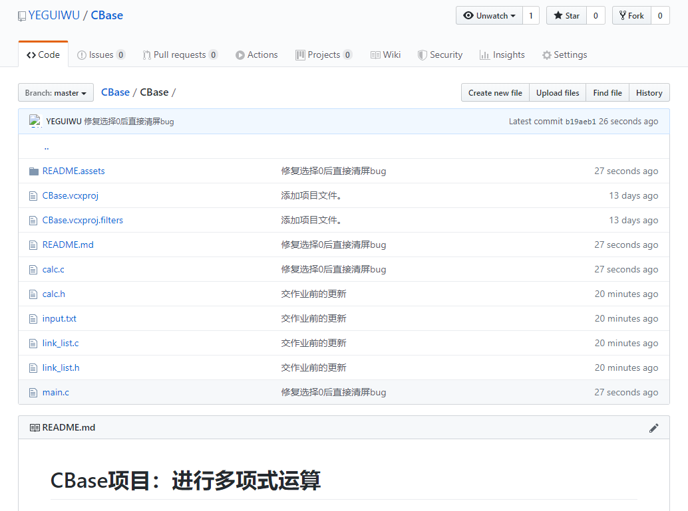
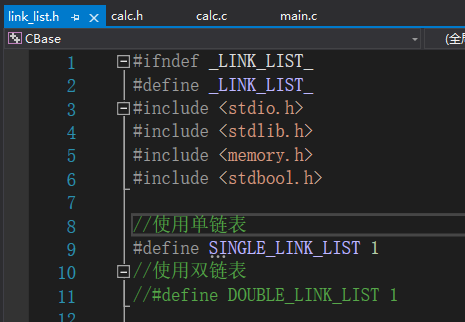
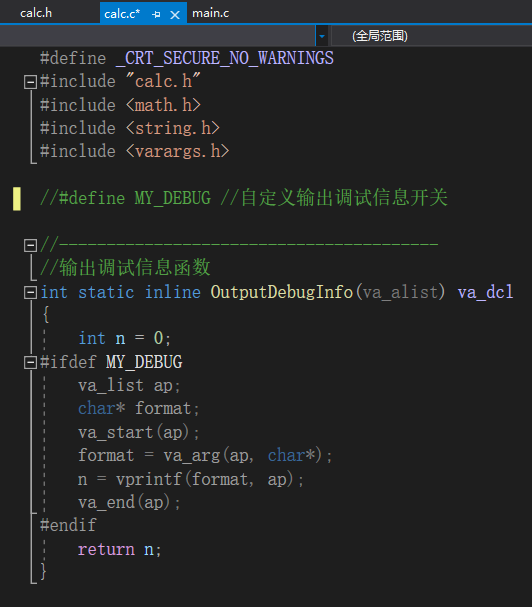
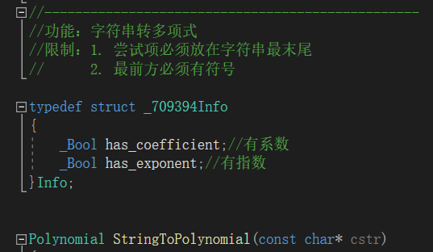
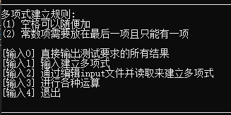
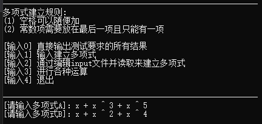
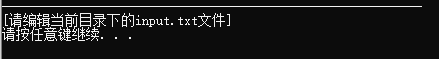
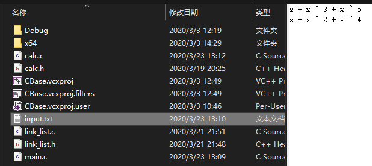
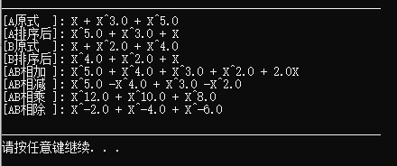
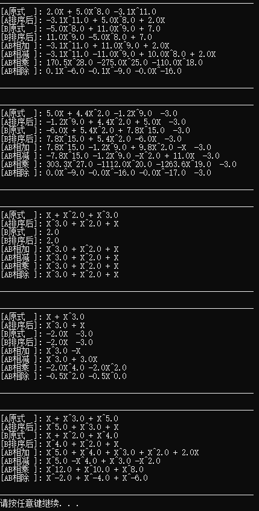

# CBase项目：进行多项式运算

【github地址】https://github.com/YEGUIWU/CBase/tree/master/CBase

[toc]

## 一、代码介绍

### 1.1 代码文件介绍

* link_list.c & link_list.h

多项式是用链表存储的，所以需要链表的实习支持，`link_list.c`存放链表函数实体，`link_list.h`存储链表函数声明。

* clac.c & clac.h

calc.c 实现了多项式的数据结构和多项式的操作

clac.h 存放了多项式类型的声明和操作的函数声明

* main.c 

主函数存放处，Demo功能

### 1.2 细节介绍

#### 1.2.1 link_list的预编译

~~~C
//使用单链表
#define SINGLE_LINK_LIST 1
//使用双链表
#define DOUBLE_LINK_LIST 1
~~~

通过改变预编译define可以替换多项式的存储实现

#### 1.2.2 calc的debug预编译

~~~C
#define MY_DEBUG //自定义输出调试信息开关
~~~

通过改变预编译define可以实现输出过程调试信息

#### 1.2.3 C字符串转多项式功能细节

1. 清空空格方便处理
2. 分情况读取
3. 读取出的指数和系数来创建单项式，再添加如多项式
4. 返回多项式

## 二、接口介绍

### 2.1 link_list 链表

~~~C
//初始化链表
void InitList(List* L);

//判断链表是否为空
_Bool ListIsEmpty(List L);

//判断某个位置是否位于链表的结尾
_Bool PosInListIsLast(ListPosition P);

//查找某个元素的位置
ListPosition FindInList(ListElementType X, List L);

//查找符合条件的结点
ListPosition FindIf(_Bool(*p)(), List L);

//销毁结点
void DestroyListNode(PtrToListNode p);

//从链表中删除某个元素
void DeleteFromList(ListElementType X, List L);

//查找某个元素的上一个位置
ListPosition FindPrePosFromList(ListElementType X, List L);

//将数据封装成结点
PtrToListNode MakeListNode(ListElementType elem);

//尾插入元素
List PushBack(ListElementType X, List L);

//头插入元素
List PushFront(ListElementType X, List L);

//删除尾部
List PopBack(List L);

//删除头部
List PopFront(List L);

//往某个位置放入某个元素
void InsertToList(ListElementType X, ListPosition P);
//清空链表
List DestroyList(List L);

//获取链表头结点位置
ListPosition HeadOfList(List L);

//获取链表尾结点位置
ListPosition TailOfList(List L);

//获取链表的第一个元素
ListElementType FirstOfList(List L);

//获取链表的最后一个元素
ListElementType FinalOfList(List L);

//返回上一个位置
ListPosition AdvanceOfListPos(ListPosition P, List L);

//从节点位置取出元素的值
ListElementType RetrieveFromListPos(ListPosition P);

//打印链表
void DisplayList(List L, void(*pDisplayFunc)(ListPosition));

//排序链表
void SortList(PtrToListNode pHead, 
	PtrToListNode pEnd, 
	int(*pCmp)(ListElementType, ListElementType));

//获取链表的大小
unsigned int ListSize(List L);

//警告错误，打印错误信息
void ListError(const char* errMsg);

//严重错误，打印错误信息，并退出程序
void ListFailError(const char* errMsg);
~~~

### 2.2 calc多项式

~~~C
//构造单项式
Monmial MakeMonomial(double coefficient,double exponent);
//销毁单项式
void DestroyMonmial(Monmial p);
//初始化多项式
Polynomial InitPolynomial();
//销毁多项式
Polynomial DestoryPolynomial(Polynomial poly);
//追加常数项
Polynomial PushConstant(Polynomial poly, const double constant);
//追加单项式
Polynomial PushMonmial(double coefficient, double exponent, Polynomial poly);
//打印多项式
void PrintPolynomial(const Polynomial poly);
//排序多项式
void SortPolynomial(Polynomial poly);
//拷贝单项式
Monmial CopyMonmial(Monmial pMonm);
//拷贝多项式
Polynomial CopyPolynomial(Polynomial poly);
//多项式乘除法
Polynomial PolynomialMultiply(Polynomial polyLeft, Polynomial polyRight);
Polynomial PolynomialDivide(Polynomial polyLeft, Polynomial polyRight);
//多项式加减法
Polynomial PolynomialAdd(Polynomial polyLeft, Polynomial polyRight);
Polynomial PolynomialSubtract(Polynomial polyLeft, Polynomial polyRight);
//make字符串
String MakeString(const char* cstr);
//remake字符串
String ReMakeString (String str, const char* cstr);
//销毁字符串
void DestoryString(String str);
//字符串转多项式
//限制：1. 尝试项必须放在字符串最末尾
//	   2. 最前方必须有符号
Polynomial StringToPolynomial(const char* cstr);
~~~

## 三、main Demo

### 3.1 菜单主页

### 3.2 键盘输入

#### 3.2.1 选择1键盘输入建立多项式

#### 3.2.2 选择3进行各种运算

### 3.3 文件输入

#### 3.3.1 选择2进行文输入建立多项式

#### 3.3.2 编辑项目工作目录下的input.txt文件

#### 3.3.3 选择3进行各种运算

### 3.4 直接输出所有测试结果

